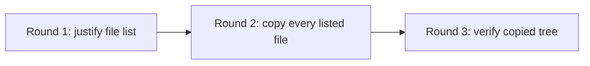

# Plan project - seed ticket

Create in `Backlog`. After all seeds and relations are verified, move to
`Active` unless the human requested a hold. The requirements/design relation
prevents dispatch until the predecessor is Done. Blocking is a property, not a
workflow status; never require `Blocked` or use `Do Not Use`.

## Scope

Read the confirmed project sources, the requirements/design document, and the
generic docs in `docs/symphony-plans/`. Produce a reviewable Symphony fan-out
plan at `docs/symphony-plans/fan-out-plan-DEMO-NNN-{{project-code}}.md`, where
`DEMO-NNN` identifies this planning ticket or project.

This planning step owns decomposition, implementation tickets, dependencies,
and final wrap-up, including publishing, review, deployment, cleanup, and
finalization required by the brief. Reuse any existing human-requested seeds
or moved tickets in the plan. Submit the plan for human PR review before
fan-out creates downstream tickets.

Do not create downstream tickets or implement project work from this ticket.

Reuse existing shared planning tooling, including `$SYMPHONY_TOOLING_ROOT/tools/symphony-dag/`, for
DAG validation and payload rendering. Raise gaps through the PR guidance below;
do not build parallel project-local planning infrastructure without human
direction. Project-specific implementation tooling within the reviewed project
scope, such as extraction redaction generators, remains allowed in the plan.

## Assumptions

- Project code: `{{project-code}}`
- Project color: `{{project-color}}`
- Base branch: `{{base-branch}}`
- Human lead: `{{human-lead}}`
- Required source documents: `{{required-source-documents}}`
- Requirements/design source: `{{requirements-design-source}}`

## Success Criteria

- Default generated tickets to `Active` after relation setup unless the human
  explicitly requests a hold. Unfinished predecessors gate dispatch through
  relations. Use temporary Backlog staging only to construct and verify the DAG.
- The plan preserves confirmed metadata and states material assumptions using
  available context and reasonable defaults. Ask only unresolved questions whose
  answers would materially change the plan or an authorized next action; name
  the affected decision. Treat discoverable values and compatibility checks as
  execution tasks, and external inputs as dependencies of only the affected
  work. Do not invent observed values or evidence.
- The plan records source documents read and source documents unavailable.
- The plan contains per-task items, each with scope, file or target ownership,
  concrete external-resource ownership/use, estimated PR size, easy/hard
  difficulty, exclusions, dependencies, validation expectations, and initial
  labels. Parallel work has disjoint files and no conflicting resource use.
- Each implementation task orders validation **local → Docker if needed → mandatory CI**, with
  applicable host commands, container command/image or a justified skip, and
  CI workflows/checks on the published commit. If relevant tests pass locally,
  skip Docker; use it only when required tests cannot run in the local
  environment. CI is always required as the shared validation surface. Preserve CI
  evidence requirements for small and documentation-only changes. Follow
  `$SYMPHONY_TOOLING_ROOT/docs/engineering/symphony/proof-of-work.md#validation-order`.
- The plan briefly compares a few materially different decompositions and
  explains the chosen breakdown, its dependency rounds, and main tradeoffs.
- The plan is structured enough that a human, script, or agent can turn each
  item into a ticket with no further judgment.
- Unless the confirmed project explicitly asks for a linear plan or asks to
  avoid a DAG, the plan includes the DAG contract fields listed below instead of
  flattening the work into a sequential plan.
- Changes to shared planning schemas or criteria require human direction;
  project-specific planning fields stay within the reviewed project scope.

## Decomposition Judgment

Before settling on a breakdown, consider a small number of reasonable
alternatives, for example two or three that differ in work boundaries or
dependency structure. Choose a strong practical plan and capture the comparison
and selection rationale in a short paragraph or a few bullets. Avoid exhaustive
searches, scoring frameworks, or lengthy alternative-plan documents.

Weigh these criteria together rather than treating them as independent gates:

- **Coherence:** each node owns a coherent piece of work and set of files, with
  an outcome a reviewer can understand independently in one PR.
- **Reviewable size:** aim for fewer than roughly 1,000 changed lines per PR.
  Estimate the size; this is a heuristic, not a hard limit or CI gate.
- **DAG height:** keep the longest dependency chain short where sensible. State
  the minimum dependency rounds (counting nodes along the longest path), not an
  elapsed-time estimate or a promise about available worker capacity.
- **Parallel ownership:** tasks that may run in parallel must have disjoint
  files and no conflicting use of external resources. Name concrete resources,
  such as a database reset target, shared test account, or publish
  destination, and the operation that could conflict. Different files alone do
  not establish independence; shared read-only context is not itself a conflict.

Repeated edits to the same files or conflicting use of the same resources need
explicit ordering and scope handoffs, which can increase DAG height. Compare
that cost with keeping related work together and keeping PRs reviewable. Do not
serialize everything or combine everything into one enormous node to optimize
one metric. Record ownership, conflicts, and sequencing in the existing fan-out
fields (`owned_files`, `owned_external_resources`, `dependencies`, and
`delivery_notes`) without inventing a new schema.

Exception example: copying one whole folder is a highly coherent mechanical
operation and may produce an arbitrarily large, reviewable diff. Selecting and
copying assorted files together embeds substantive selection decisions. A small
first node can create and justify an explicit file list; a second node can
mechanically copy every listed file and be reviewed against that list, even if
its diff far exceeds 1,000 lines. Separate review of decisions from verification
of execution. Do not split coherent mechanical work just to hit the size target,
or hide selection or behavior changes under the word “mechanical.”

## DAG Plan Requirements

Use this section by default. Omit it only when the confirmed project sources
explicitly ask for a linear plan or ask to avoid a DAG.

Make the overall plan understandable essentially from the Mermaid diagram
alone. Label nodes with meaningful outcomes and work boundaries, not just ticket
IDs, and make dependency rounds visible through the flow direction and labels.
Use syntax supported by the shared parser, including one edge per line.

For example, show `A → B → C` without a redundant `A → C` when the extra edge
adds no independent requirement:

Use the same minimal dependency representation in the plan's Mermaid block,
standalone `.mmd`, manifest, and direct Linear relation payloads. Existing checks
require exact graph/manifest edge equality, not merely equivalent reachability;
do not reduce only the picture. Preserve reachability and retain any direct edge
with an independently meaningful requirement, documenting its reason. Reuse
shared tooling; if a required representation is unsupported, report the gap and
validation limitation through `## Proposed process change` below instead of
adding a project-local validator or silently dropping the requirement.

For a DAG plan, include:

- a Mermaid graph marked `%% symphony-dag/v1` in the plan and as a standalone
  `.mmd` document;
- exactly one `symphony-dag-manifest/v1` block with project metadata, defaults,
  nodes, edges, node types, branch declarations, PR policies, maturity defaults,
  relation semantics, and decisions. Do not include
  v1-only generated join artifacts, `base_node`, `stack_policy`, `stack:*`,
  branch-base exceptions, rebase-on-land, or neutralization;
- a branch manifest naming task branches. Task branches must declare the
  selected base branch as both branch base and PR base, open draft PRs by
  default, and remain clean of committed predecessor work that is not on the
  selected base branch;
- a Decisions section listing each architecture or workflow call, rationale,
  and the ticket or artifact that enforces it;
- Linear relation payloads for every hard DAG edge. Preserve direction as
  `issueId: <blocker>`, `relatedIssueId: <blocked>`, `type: blocks`;
- direct fan-in semantics: represent fan-in with multiple direct incoming
  blocker relations to the downstream issue. Do not create no-op join tickets or
  generated join branches;
- mature-label behavior: `mature` is set on a blocker only when required CI
  passes and Cadence or the configured reviewer approves the current PR head,
  mandatory feedback is closed, the task branch is clean, and the PR is ready
  for human review from draft. Record the reviewed SHA, verdict and matching
  workpad evidence; review-relevant activity after approval requires another
  review. Remove maturity only for request-changes review, rejected acceptance
  evidence, stale current-head evidence, or a similarly severe
  downstream-invalidating regression;
- source availability is not deployment evidence; record installed refs and
  actual execution separately when deployment is required;
- fail-closed behavior for missing required labels, workflow states, assignees,
  branch refs, issue ids, relation endpoints, or relation direction.

## Labels

- Linear labels: `{{linear-labels}}`
- GitHub PR labels for future implementation PRs: `{{github-pr-labels}}`

## Dependencies

Blocked by the requirements-and-design ticket. The project factory should create
that Linear blocker relation by default. Treat other project dependency language
as sequencing guidance, not Linear blocker relations, unless a human explicitly
asks for blocker links.

## Workpad Expectations

Keep a single Linear comment headed `## Codex Workpad`. Record the selected base
branch, source-read evidence, assumptions, unresolved questions, plan path,
schema or criteria changes, and final plan validation.

## PR Expectations

If the plan is committed, branch from `{{base-branch}}` and open the PR against
`{{base-branch}}`. Use branch pattern
`symphony/{{project-code}}/<ticket-id>/<free-text>`. Apply required GitHub PR
labels, including `{{project-color}}` and any project-required labels such as
`symphony`.

If existing tooling or instructions expose a process gap, add a
`## Proposed process change` section to the PR body. Describe the gap, its
impact, and the smallest suggested improvement. Do not implement the process
change, create tickets for it, or build a project-local substitute without human
direction. Continue the assigned work where possible, stating any validation
limitation and reporting actual blockers.

Include the section only for an actual proposal; do not invent proposals or add
empty sections. The human reviews the suggestion and decides whether to
commission it, for example by requesting a Misc ticket. A proposal is advisory,
not a new acceptance gate, and does not block otherwise valid assigned work.

## Validation Expectations

- Validate this ticket's repository changes **local → Docker if needed → mandatory CI**:
  skip Docker when relevant tests pass locally; use it for local environment
  gaps. Record skips and current-commit CI evidence per the proof
  standard. Fix actionable failures before publishing.
- Markdown formatting passes for the committed plan and any touched generic
  planning docs.
- Existing shared checks validate the matching Mermaid, manifest, and direct
  relation payloads; review the diagram for clear boundaries and rounds.
- The plan can be rendered into implementation ticket payloads for inspection
  without live Linear writes.
- Required source material is either read successfully or recorded as an
  explicit blocker.
