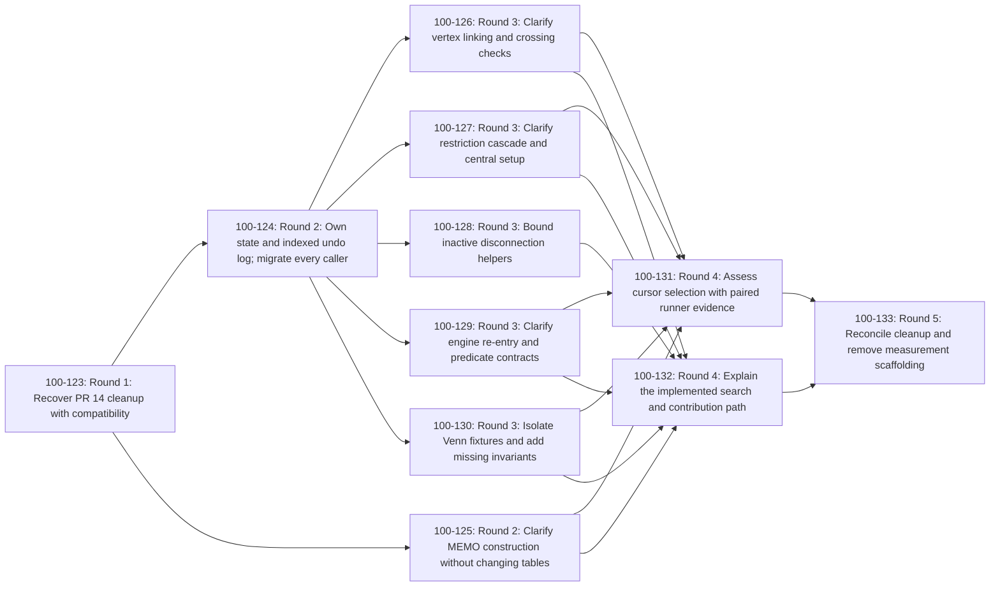

# Venn cleanup fan-out plan

## Outcome and review boundary

Eleven implementation tasks, twenty hard edges, **five dependency rounds**. The
longest paths include RECOVER → SAFETY → TESTS → MEASURE → FINAL and RECOVER →
SAFETY → VERTEX → DOCS → FINAL. Rounds count nodes, not elapsed time or worker capacity.
This plan prepares the working search for future mathematical work by preserving
prior cleanup, closing the trail safety boundary, clarifying code and tests, and
reconciling documentation and evidence. LP implementation is excluded.

This is the proposed plan for [100-111](https://linear.app/1000lines/issue/100-111).
Human review/merge of this plan precedes any implementation fan-out. This ticket
creates no implementation issues. Existing [100-112](https://linear.app/1000lines/issue/100-112)
owns creation after acceptance; reuse it, and do not duplicate the three seeds.

| Metadata                               | Confirmed value                                                                                                                                                                                           |
| -------------------------------------- | --------------------------------------------------------------------------------------------------------------------------------------------------------------------------------------------------------- |
| project_code / project_color           | venn-cleanup / red                                                                                                                                                                                        |
| repository / base_branch               | jeremycarroll/venn-search-rs / main                                                                                                                                                                       |
| target_project                         | [Venn cleanup for the next stage](https://linear.app/1000lines/project/venn-cleanup-for-the-next-stage-75b1ed33f42c)                                                                                      |
| human_lead                             | Jeremy Carroll; GitHub jeremycarroll; Linear c65b9fbe-e740-47e9-b444-3172d3526ff2                                                                                                                         |
| team / project IDs                     | 100 / 2d7d1d7e-47ff-45d2-8097-19307ad5a589; project c7788367-14ec-41d4-bcf4-7230d30288dc                                                                                                                  |
| github_pr_labels / linear_issue_labels | symphony, red / red, Improvement                                                                                                                                                                          |
| baseline_context                       | main 8c3df8bca54c6b1ff59127c37ae14cfc4dac5e72                                                                                                                                                             |
| requirements/design                    | [Merged design](https://github.com/jeremycarroll/venn-search-rs/blob/8c3df8bca54c6b1ff59127c37ae14cfc4dac5e72/docs/symphony-plans/venn-cleanup/requirements-and-design.md), R1–R10, D1–D7, L01–L92, V1–V4 |
| design acceptance                      | Jeremy [approved PR #17](https://github.com/jeremycarroll/venn-search-rs/pull/17#pullrequestreview-5188097630), then merged it on 2026-09-12; 100-110 is Done                                             |

The design’s “Proposed” snapshot text predates that merge. Its explicit O1 remains
visible: the executable N4/N5 tests assert **16/17**, while the brief says **3/23**.
No human explanation or count-changing instruction was present in the approval.
`known_open_decisions`: O1 belongs to Jeremy; preserve executable 2/16/17/233 and
all signature assertions, correct unsupported claims as observations, and block
only final numeric acceptance or a requested count change on an explicit human
resolution. Do not infer isomorphism semantics or change search behavior. This
execution input does not change the decomposition or require another planning
approval question.

## Decomposition choice

Three alternatives were considered. Four large module groups would reduce
handoffs but combine unrelated safety, propagation and testing changes. Twelve
brief-shaped units would leave a small, diffuse naming/geometry task and would
incorrectly separate safety caller migration. The chosen eleven units absorb
concrete predicate hygiene into ENGINE, keep geometry mutation/encoding with
SAFETY, and reserve cycle selection for MEASURE. Unchanged geometry primitives
need no standalone sweep. The existing propagation/memo module splits are reused.

One recovery PR is mainly existing authored moves/imports. One larger safety PR
is necessary because D3 requires every caller to migrate with the paired owner;
unsafe compatibility seams would defeat its acceptance contract. Later module
cleanup stays disjoint. MEMO can run beside SAFETY. DOCS and MEASURE use stable
Round 3 outcomes independently, then FINAL joins their evidence and removes the
temporary measurement support. No dependency merely encodes preferred order.

| Task       | Expected additions / deletions and paths             | Difficulty |
| ---------- | ---------------------------------------------------- | ---------- |
| RECOVER    | +550 / -560; about 18 paths; mostly moves            | hard       |
| SAFETY     | +1000 / -650; 39 paths; safety integration exception | hard       |
| MEMO       | +230 / -170; 5 paths                                 | hard       |
| VERTEX     | +180 / -110; 1 path                                  | hard       |
| RESTRICT   | +200 / -130; 3 paths                                 | hard       |
| DISCONNECT | +140 / -80; 1 path                                   | hard       |
| ENGINE     | +320 / -230; 8 paths                                 | hard       |
| TESTS      | +250 / -170; 8 paths                                 | hard       |
| MEASURE    | +180 / -80; 5 paths; may retain no optimization      | hard       |
| DOCS       | +480 / -320; 6 paths                                 | easy       |
| FINAL      | +230 / -400; 5 paths                                 | hard       |

These are review estimates, not quotas. Recovery relocations and the complete
safety boundary may exceed 1,000 changed lines; explain their coherent scope,
not an invented mechanical label for new design decisions. No node may expand
ownership silently to meet an estimate.

## DAG

All edges below are accepted-plan hard blockers once this plan is approved:
upstream outcome merged to main and upstream issue Done. Direct relations gate
dispatch; `mature` records review readiness and does not authorize committing
unmerged predecessor work. Read-only investigation can proceed while a blocker
is unfinished. Each task branches from main, never another task branch.



## Fan-out mapping

The plan was approved in [PR #18](https://github.com/jeremycarroll/venn-search-rs/pull/18#pullrequestreview-5188201819)
and merged at `5ebf31261a9b651957cc82f6fed1059d3f2c3770`. [100-112](https://linear.app/1000lines/issue/100-112/trigger-fan-out)
created the eleven issues below in Backlog, verified their labels, assignee,
complete descriptions and all twenty direct blocker relations, then activated
the full set. The pinned Codex workpad records mutation inputs and API readbacks.
This mapping preserves every manifest key, node ID, branch template and edge.

| Node / payload key         | Linear issue                                                                                               | Task branch (branch base and PR base: main) |
| -------------------------- | ---------------------------------------------------------------------------------------------------------- | ------------------------------------------- |
| RECOVER / VC-RECOVER       | [100-123](https://linear.app/1000lines/issue/100-123/recover-pr-14-cleanup-with-compatibility)             | `symphony/venn-cleanup/100-123/recover`     |
| SAFETY / VC-SAFETY         | [100-124](https://linear.app/1000lines/issue/100-124/own-state-and-indexed-undo-log-migrate-every-caller)  | `symphony/venn-cleanup/100-124/safety`      |
| MEMO / VC-MEMO             | [100-125](https://linear.app/1000lines/issue/100-125/clarify-memo-construction-without-changing-tables)    | `symphony/venn-cleanup/100-125/memo`        |
| VERTEX / VC-VERTEX         | [100-126](https://linear.app/1000lines/issue/100-126/clarify-vertex-linking-and-crossing-checks)           | `symphony/venn-cleanup/100-126/vertex`      |
| RESTRICT / VC-RESTRICT     | [100-127](https://linear.app/1000lines/issue/100-127/clarify-restriction-cascade-and-central-setup)        | `symphony/venn-cleanup/100-127/restrict`    |
| DISCONNECT / VC-DISCONNECT | [100-128](https://linear.app/1000lines/issue/100-128/bound-inactive-disconnection-helpers)                 | `symphony/venn-cleanup/100-128/disconnect`  |
| ENGINE / VC-ENGINE         | [100-129](https://linear.app/1000lines/issue/100-129/clarify-engine-re-entry-and-predicate-contracts)      | `symphony/venn-cleanup/100-129/engine`      |
| TESTS / VC-TESTS           | [100-130](https://linear.app/1000lines/issue/100-130/isolate-venn-fixtures-and-add-missing-invariants)     | `symphony/venn-cleanup/100-130/tests`       |
| MEASURE / VC-MEASURE       | [100-131](https://linear.app/1000lines/issue/100-131/assess-cursor-selection-with-paired-runner-evidence)  | `symphony/venn-cleanup/100-131/measure`     |
| DOCS / VC-DOCS             | [100-132](https://linear.app/1000lines/issue/100-132/explain-the-implemented-search-and-contribution-path) | `symphony/venn-cleanup/100-132/docs`        |
| FINAL / VC-FINAL           | [100-133](https://linear.app/1000lines/issue/100-133/reconcile-cleanup-and-remove-measurement-scaffolding) | `symphony/venn-cleanup/100-133/final`       |

The graph above and standalone `fan-out-plan.mmd` carry the same identifier
prefixes. Mermaid click directives are omitted because the accepted shared
`symphony-dag` parser rejects them; the table supplies clickable issue links
without changing its supported graph syntax. Reapplying annotations replaces
an existing identifier prefix instead of duplicating it.

## Common task contract

These requirements are part of **every** generated ticket. Copy this section,
the applicable P recipe when named, the node’s complete item section, its
manifest branch/PR declaration and its incoming direct relations into that
ticket. A link to this plan alone is not a substitute for exact ownership.

- `source_files`: each node’s complete `owned_files` list (planned new files are
  created only by their named owner); read the accepted design and plan, current
  README/CLAUDE/SYMPHONY, selected-base config and CI. Other files are read-only
  context. New filenames below are deliberate, not assumed existing files.
- `source_notes`: shared sources in the ledger below; fetch current main and
  refresh incoming human feedback. Required source access failure blocks only
  dependent work. Do not replace an unreadable primary source with a summary.
- `initial_labels`: red, Improvement on Linear; symphony, red on GitHub. Never
  initially label a new task mature. Assign every issue/PR to Jeremy.
- `owned_external_resources`: only this node’s Linear issue/workpad, task branch
  and PR in jeremycarroll/venn-search-rs; CI workspaces/artifacts qualified by that
  PR, run ID, attempt and color. No database, service, deployment, shared test
  account or shared output directory is used. Tests run in isolated per-issue
  workspaces and separate GitHub job filesystems; cleanup touches only their
  own output paths. Existing Actions caches are service-managed immutable cache
  entries, not shared writable build directories. No task resets/prunes them.
- Shared GitHub/Linear label definitions are preflight setup owned by 100-112;
  implementations apply existing definitions only. Recovery reads PR #14;
  Jeremy exclusively owns mutation/merge/closure of that historical PR.
- `dependencies`: one hard entry per incoming edge in each node section below,
  all requiring merge to main plus predecessor Done. `delivery_notes` define
  file/resource handoffs. Do not add inferred relations for read-only context.
- Each task opens a draft PR from main against main with its declared branch,
  a [ticket-id] title prefix, current scope/evidence and required labels.
  Keep unmerged predecessor work out of the task branch. If publication can
  proceed independently, publish a draft dependency note; pause the dependent
  implementation, not authorized independent preparation.
- Apply blocker-side `mature` only after required current-head CI passes, fresh
  Cadence approval of that head, mandatory feedback closure, a clean task branch
  and ready-from-draft status. Record reviewer, SHA, verdict and matching
  Cadence workpad. Inspect all submitted/inline/conversation/Linear feedback;
  new review-relevant activity requires a fresh review. Remove maturity for
  request-changes, rejected/stale acceptance evidence or severe regression;
  ordinary edits alone do not remove it. A failed mature-label API operation
  is recorded and waits Inactive. Human acceptance/merge owns Done.
- `integration_pattern: none` unless SAFETY/MEASURE explicitly name the temporary
  measurement support below. Permanent D2 import aliases and the pre-existing
  inactive disconnection feature are intentional end-state decisions, audited
  by FINAL; they are not workarounds for unmerged predecessors.
- `completion_gates`: all R1–R10 and L01–L92 dispositions, integrated main CI,
  closed review feedback, O1’s human resolution before final numeric acceptance,
  removed temporary measurement support and human final acceptance. No deploy.

### V: validation for every task

Configured and effective mode: **remote**, from selected-base
`.symphony.cfg.json` and 100-111/project **Explicit validation and activation
direction**. This human direction supersedes generic local/Docker ordering.

1. Run useful available checks locally: `git diff --check`; for changed Markdown,
   `npx --yes prettier@3.6.2 --check <explicit owned Markdown paths>`; inspect
   changed test assertions and interfaces. No local Cargo installation is required.
   Hosted Rust build/tests are unrun locally, not passing local evidence.
2. Docker: **skipped — explicit remote validation direction**. No image/digest
   is required; do not add a Docker prerequisite or duplicate pipeline.
3. Publish and require the current-head six checks in `.github/workflows/ci.yml`,
   GitHub Actions App **15368**:

| Check                  | Existing runner command                                                                                            |
| ---------------------- | ------------------------------------------------------------------------------------------------------------------ |
| Test Suite (NCOLORS=3) | `cargo test --release --features ncolors_3 --verbose`; `cargo test --release --doc --features ncolors_3 --verbose` |
| Test Suite (NCOLORS=4) | `cargo test --release --features ncolors_4 --verbose`; `cargo test --release --doc --features ncolors_4 --verbose` |
| Test Suite (NCOLORS=5) | `cargo test --release --features ncolors_5 --verbose`; `cargo test --release --doc --features ncolors_5 --verbose` |
| Test Suite (NCOLORS=6) | `cargo test --release --features ncolors_6 --verbose`; `cargo test --release --doc --features ncolors_6 --verbose` |
| Clippy (Linting)       | `cargo clippy --all-targets -- -D warnings`; `cargo clippy --all-targets --features ncolors_5 -- -D warnings`      |
| Format Check           | `cargo fmt --all -- --check`                                                                                       |

Features are mutually exclusive. Never use `--all-features`, weaken assertions,
remove a required command or count skipped/pending/stale/canceled checks as pass.
The node-specific tests below run within these existing suites; focused commands
may select `--test <owned test stem>` or the module filter on the relevant runner.
Each feature is a separate job, including doc tests. Documentation-only and
no-optimization evidence PRs also require all six checks.

Workpads/PRs record target SHA, base, exact command/environment, acceptance
criterion, durable artifact/run URL, event/App/run attempt/child results,
limitations and next handoff. CI pending/missing → Unhappy plus wake:15m;
failed checks → Active; all required checks passing → Inactive for review.
Cadence (HackCadence App, configured Codex preference) is a separate current-head
review gate; observe actual reviewer/provider/verdict rather than assuming it.
Do not request human review before normal Cadence closure or its documented
review-loop-cap handoff. Source availability is not live execution evidence.

### P: bounded measurement recipe (SAFETY, then MEASURE, then removal by FINAL)

Use existing CI’s NCOLORS=6 runner, not a new workflow. SAFETY owns adding one
project-specific step after the existing tests/doc tests, with executable/args
`["bash", "scripts/measure-cleanup.sh", "<baseline-main-SHA>", "<exact-PR-head-SHA>"]`.
Resolve both immutable SHAs from the current PR/run, fetch those objects, and
record them. The step is conditional on a pull-request run; integrated main
retains the existing mandatory tests. No Actions secrets, installs, permissions,
label definitions, workflow triggers or check names change.

The small script creates two disposable checkouts **inside that job workspace**,
builds each with that runner’s same Rust toolchain/release flags and NCOLORS=6,
and runs the same standalone `tests/cleanup_measurement.rs` probe in both. The
new measurement test is explicitly ignored by ordinary suites; the script invokes
`cargo test --release --features ncolors_6 --test cleanup_measurement -- --ignored --nocapture --test-threads=1`.
All existing tests remain enabled. Build both probes before measuring, then run
their test executables serially for the alternating repetitions below.
The probe uses preserved public constructors/EngineBuilder/Predicate/search
interfaces and a quiet counter, so it can be injected unchanged into the old
and new checkout without production-code replacement. It runs the existing
Initialize → InnerFace → Venn → counter → Fail workload, asserting 233 results.
Start timing after context/MEMO construction; exclude compilation and file I/O.
Use one warmup and five measured full searches per ref, alternating baseline/head
order. Retain every sample and median, exact command/toolchain/runner identity,
input/feature/output settings and clean source-ref provenance in CI logs and the
node’s committed evidence document. Do not benchmark with concurrent tests.

SAFETY additionally records old/new trail entry size/capacity and explains a
material time/memory regression. MEASURE additionally measures the actual cursor
selection, using the same test-only private probe on both disposable refs when
necessary; cover identical sparse/dense cursor sequences and separate it from
full-search timing. Test-only injection is disclosed with its exact diff/hash;
it is measurement support, never represented as committed baseline production
code. A candidate is retained only with correct, simple code and comparable
evidence; no fixed speedup quota. Unavailable runner execution is a named evidence
gap, not a fabricated no-change finding.

`integration_pattern` for SAFETY and MEASURE:

```yaml
pattern: finalizer_todo
seam_owner: SAFETY, then MEASURE, then FINAL
seam_files:
  - tests/cleanup_measurement.rs
  - scripts/measure-cleanup.sh
  - .github/workflows/ci.yml
marker: VENN_CLEANUP_MEASUREMENT
isolated_validation: V plus P on the node's clean main-based PR
composed_validation: P with explicit baseline/head refs; final main CI after removal
finalize_item: VC-FINAL
finalize_action: Delete the two temporary files and only the tagged measurement step; retain committed evidence and every original required CI command.
```

`finalization_responsibility`: FINAL searches for that exact marker and those
three paths, verifies removal, and links SAFETY/MEASURE evidence. MEASURE may edit
the script/probe; the workflow step needs no later change until FINAL removes it.
Any additional temporary production instrumentation must be removed within
MEASURE before its merge, so FINAL has no unlisted source-file cleanup authority.

## Task items

The complete fields below plus the Common task contract are the ticket bodies.
`VC-*` keys are stable plan keys, **not existing Linear identifiers**.

### RECOVER: Recover PR 14 cleanup with compatibility

- `ticket_title`: Recover PR 14 cleanup with compatibility
- `payload_key`: VC-RECOVER
- `difficulty`: hard
- `estimated_pr_size`: +550 / -560; about 18 paths; mostly moves
- `scope`: Recover D1/D2 and L01–L16/L28 from PR #14 against current main, preserving attribution and recent fixes.
- `owned_files` (exact edit/create/delete authority):

```text
src/symmetry/s6.rs
src/symmetry/canonical.rs
src/symmetry/mod.rs
src/state/edge.rs
src/state/mod.rs
src/state/faces.rs
src/geometry/edge.rs
src/geometry/mod.rs
src/context/mod.rs
src/context/dynamic.rs
src/context/memoized.rs
src/lib.rs
src/predicates/advanced_test.rs
src/predicates/innerface.rs
src/predicates/venn.rs
src/propagation/curve_disconnection.rs
src/propagation/vertices.rs
tests/venn3_test.rs
```

`required_actions`:

1. Refresh PR #14 state, head, all seven commits, diff, submitted reviews, inline threads and conversation. Reuse only if a clean main-based task diff and authorized branch ownership are possible; otherwise use the replacement task branch declared below.
2. Selectively recover debug/static-mut removal, canonical symmetry naming, DynamicEdge relocation and the context split. Preserve useful initialization/error diagnostics and main’s two Clippy fixes. Do not copy the old checklist.
3. Keep durable compatibility re-exports for symmetry::s6, geometry::EdgeDynamic and geometry::edge::EdgeDynamic; keep root exports and constructors. Cite each reused original SHA and retain Jeremy/Claude attribution. Repair the leftover EdgeDynamic prose locally.

`acceptance_checks`:

- V applies, with existing symmetry, geometry edge, context and venn3 tests plus compile/doc-test coverage of old import paths. Verify the diff contains only recovery, compatibility and required imports.
- Read back merged paths before releasing file ownership. A replacement PR explicitly links #14; Jeremy owns merge/closure of the old PR.

`dependencies`:

None within the implementation DAG. 100-112 creates/activates this task only after accepted plan fan-out.

`exclusions`: No trail redesign, constructor optimization, docs/CLEANUP.md completion edits, force-push/merge/closure of #14, or broad naming sweep.

`delivery_notes`: One larger mechanical PR is coherent: all four old changes are already authored and imports overlap. Explain relocations separately from compatibility additions. The permanent import aliases are intentional supported API, not temporary integration seams.

### SAFETY: Own state and indexed undo log; migrate every caller

- `ticket_title`: Own state and indexed undo log; migrate every caller
- `payload_key`: VC-SAFETY
- `difficulty`: hard
- `estimated_pr_size`: +1000 / -650; 39 paths; safety integration exception
- `scope`: Implement accepted D3/D4 as one compiling safety boundary: private paired state/log, closed indexed undo targets, checked encodings, and mechanical repository-wide API migration.
- `owned_files` (exact edit/create/delete authority):

```text
src/trail/mod.rs
src/context/mod.rs
src/context/dynamic.rs
src/state/mod.rs
src/state/faces.rs
src/state/edge.rs
src/geometry/corner.rs
src/geometry/edge.rs
src/geometry/cycle_set.rs
src/geometry/mod.rs
src/propagation/mod.rs
src/propagation/core.rs
src/propagation/setup.rs
src/propagation/adjacency.rs
src/propagation/non_adjacency.rs
src/propagation/color_removal.rs
src/propagation/vertices.rs
src/propagation/curve_disconnection.rs
src/propagation/corner_detection.rs
src/propagation/validation.rs
src/engine/mod.rs
src/engine/predicate.rs
src/predicates/initialize.rs
src/predicates/innerface.rs
src/predicates/venn.rs
src/predicates/advanced_test.rs
src/predicates/test.rs
src/symmetry/canonical.rs
src/lib.rs
tests/common/mod.rs
tests/trail_integration_test.rs
tests/engine_integration_test.rs
tests/venn_integration_test.rs
tests/venn6_test.rs
tests/known_solution_test.rs
tests/cleanup_measurement.rs
scripts/measure-cleanup.sh
.github/workflows/ci.yml
docs/symphony-plans/venn-cleanup/trail-evidence.md
```

`required_actions`:

1. Cover all ten D3 target kinds. Validate indices and packed fields in release builds, record old values before writing, replay against the same owner, and retain bounded 16,384-entry overflow/freeze semantics.
2. Expose immutable state access and narrow checkpoint/rewind/freeze, output lifecycle, accumulator and untrailed retry-cursor methods. Do not allow replacement of one half, mutable Vec escape or arbitrary state/log pairing. Remove retained pointer writes and CrossingCounts::get_mut_ptr from the mutation contract.
3. Migrate every listed caller/test in this PR. Keep control flow, error payloads, depth order, count assertions, inactive disconnection and consuming search signature unchanged. Read-only DynamicState consumers may keep their signatures where compatible with private ownership.
4. Update touched module docs and compiling root examples only for the safety migration. Publish the exact API handoff and boundary tests for later owners; no later task must retain an unsafe transitional shim.
5. Use the bounded runner recipe P to measure trail entry/storage cost and paired full-search cost. Add only its two project-specific temporary files and one step inside the existing NCOLORS=6 CI job, retaining all six required jobs and their commands. Record evidence in trail-evidence.md.

`acceptance_checks`:

- V plus trail integration and module tests: moved owner then rewind; independent owners; repeated writes; nested checkpoints; freeze; overflow; failed propagation restoration; cycle count and word restoration; cursor persistence; reset pairing.
- Compile-fail doc tests show that safe clients cannot swap state/trail or obtain unrestricted mutable storage. Test None/zero/highest valid IDs, 63/64 words and invalid release-domain encodings. Preserve every existing N3/N4/N5/N6 assertion.
- P records both source SHAs, toolchain/runner, entry size/capacity, samples and median. Investigate a material regression before acceptance; never restore the unsound API to meet timing.

`dependencies`:

| item    | type                | requires / reason                                                                                                                                       |
| ------- | ------------------- | ------------------------------------------------------------------------------------------------------------------------------------------------------- |
| RECOVER | hard; Linear blocks | Recovered state/context/symmetry paths and aliases are merged to main; this is the required API/file handoff. Predecessor Done and its outcome on main. |

`exclusions`: No readability refactor of migrated callers, MEMO constructor edits, feature/algorithm changes, safe legacy pointer shim or new benchmark framework.

`delivery_notes`: This deliberately exceeds the usual size heuristic: splitting caller migration would expose the unsafe pairing contract between PRs. Keep authored safety logic, mechanical caller edits, tests and small measurement support separately explained within one review. MEMO owns context/memoized.rs; its initialization signature stays stable.

### MEMO: Clarify MEMO construction without changing tables

- `ticket_title`: Clarify MEMO construction without changing tables
- `payload_key`: VC-MEMO
- `difficulty`: hard
- `estimated_pr_size`: +230 / -170; 5 paths
- `scope`: Apply D2 at verified constructor seams; preserve table layout, numbering, immutable per-context ownership and existing exports.
- `owned_files` (exact edit/create/delete authority):

```text
src/memo/mod.rs
src/memo/cycles.rs
src/memo/faces.rs
src/memo/vertices.rs
src/context/memoized.rs
```

`required_actions`:

1. Factor duplicated vertex parameter calculations across the two initialization passes and face-link lookup through a narrow internal helper. Keep the initialized placeholder EdgeRefs as construction steps.
2. Clarify partner-edge lookup and actual monotonicity/adjacency construction only where it reduces complexity. Keep useful initialization summaries. Correct local speculative sharing/phase claims and use accurate examples.
3. Own memo/mod.rs re-exports and constructor-local tests. Do not split already-small mod.rs files or move helpers into files owned by SAFETY.

`acceptance_checks`:

- V plus existing memo tests for cycle tables, clockwise/incoming-slot/primary-secondary invariants, vertex IDs and face links. Add finite invariant checks only if a changed seam lacks coverage.
- No changes to public table representation, cycle ordering, eager initialization, search counts or context construction signature.

`dependencies`:

| item    | type                | requires / reason                                                                                                        |
| ------- | ------------------- | ------------------------------------------------------------------------------------------------------------------------ |
| RECOVER | hard; Linear blocks | The recovered context/memoized.rs file and its constructor are merged to main. Predecessor Done and its outcome on main. |

`exclusions`: No Arc/lazy/global MEMO, new module split, propagation edits or geometry mutation API work.

`delivery_notes`: Runs alongside SAFETY with five disjoint files. A helper shared by MEMO constructors lives in these owned files; existing public exports remain stable.

### VERTEX: Clarify vertex linking and crossing checks

- `ticket_title`: Clarify vertex linking and crossing checks
- `payload_key`: VC-VERTEX
- `difficulty`: hard
- `estimated_pr_size`: +180 / -110; 1 path
- `scope`: Simplify D5 vertex phases using the accepted safe mutation API and add dynamic-link regressions.
- `owned_files` (exact edit/create/delete authority):

```text
src/propagation/vertices.rs
```

`required_actions`:

1. Separate existing-link handling, first processing, incoming-edge connection/counting and corner validation.
2. Keep operation order, central-face corner exemption and monotonicity-related skip behavior. Keep edge_curve_checks disabled with its accurate deferral explanation; do not activate it.

`acceptance_checks`:

- V plus module-local tests for repeated vertex visits, crossing increments/restoration, incoming links, corner failure and central-face exemption. Assert unchanged active search results.
- No new failure for the currently skipped link-conflict case.

`dependencies`:

| item   | type                | requires / reason                                                                                                          |
| ------ | ------------------- | -------------------------------------------------------------------------------------------------------------------------- |
| SAFETY | hard; Linear blocks | The paired mutation API and mechanical vertices.rs migration are merged to main. Predecessor Done and its outcome on main. |

`exclusions`: No core/setup/curve-disconnection edits or propagation/mod.rs exports/tests.

`delivery_notes`: All dedicated tests stay in vertices.rs. RESTRICT owns shared propagation exports; DISCONNECT owns traversal helpers. No test registration edit in another file is required.

### RESTRICT: Clarify restriction cascade and central setup

- `ticket_title`: Clarify restriction cascade and central setup
- `payload_key`: VC-RESTRICT
- `difficulty`: hard
- `estimated_pr_size`: +200 / -130; 3 paths
- `scope`: Expose D5 restriction/setup steps without changing cascade, depth or assignment semantics.
- `owned_files` (exact edit/create/delete authority):

```text
src/propagation/core.rs
src/propagation/setup.rs
src/propagation/mod.rs
```

`required_actions`:

1. Name assigned-face validation, intersection/empty failure, cached update, forced assignment and recursive cascade.
2. Preserve recursion-depth checks, order and error payloads. Explain the inactive completed-color accumulator and retire stale 7/6 claims.
3. Own propagation/mod.rs shared exports and dispatcher documentation/tests after SAFETY. No other Round 3 unit changes that file.

`acceptance_checks`:

- V plus assigned/conflicting, empty/singleton intersection, cached count, nested cascade, depth failure and rewind fixtures in the owned files.
- Confirm the same errors and restored state at each failure boundary; do not broaden pruning.

`dependencies`:

| item   | type                | requires / reason                                                                                                         |
| ------ | ------------------- | ------------------------------------------------------------------------------------------------------------------------- |
| SAFETY | hard; Linear blocks | The paired owner, cycle-set setter and core/setup migration are merged to main. Predecessor Done and its outcome on main. |

`exclusions`: No vertex/disconnection/helper signature redesign or new propagation split.

`delivery_notes`: No shared integration-test helper edits. Existing adjacency/color-removal/non-adjacency signatures were migrated by SAFETY and remain stable.

### DISCONNECT: Bound inactive disconnection helpers

- `ticket_title`: Bound inactive disconnection helpers
- `payload_key`: VC-DISCONNECT
- `difficulty`: hard
- `estimated_pr_size`: +140 / -80; 1 path
- `scope`: Keep D5 disconnection inactive in production while making callable traversal helpers bounded and documented.
- `owned_files` (exact edit/create/delete authority):

```text
src/propagation/curve_disconnection.rs
```

`required_actions`:

1. Explain assumptions and the disabled production boundary. Preserve useful failure diagnostics after recovered debug removal.
2. Bound malformed/non-returning cycle traversal and cover open paths, closed loops and disconnected structures using module-local fixtures. Preserve the existing returned-error contract.

`acceptance_checks`:

- V plus finite fixtures that terminate on malformed cycles, distinguish open/closed structures and preserve valid-loop results.
- The production edge_curve_checks invocation remains disabled; verify no new pruning/count changes.

`dependencies`:

| item   | type                | requires / reason                                                                                            |
| ------ | ------------------- | ------------------------------------------------------------------------------------------------------------ |
| SAFETY | hard; Linear blocks | The helper migration to paired state/log access is merged to main. Predecessor Done and its outcome on main. |

`exclusions`: No activation, algorithm redesign, vertices.rs edits or new public error variants.

`delivery_notes`: Tests use private fixture construction within this owned module and the accepted mutation API; they must not reopen arbitrary mutable-state escapes. Existing disabled code is an intentional deferred feature, not a new integration seam.

### ENGINE: Clarify engine re-entry and predicate contracts

- `ticket_title`: Clarify engine re-entry and predicate contracts
- `payload_key`: VC-ENGINE
- `difficulty`: hard
- `estimated_pr_size`: +320 / -230; 8 paths
- `scope`: Combine candidate F with the concrete predicate part of H: characterize actual re-entry, clarify dispatch and correct stale initialization/predicate prose.
- `owned_files` (exact edit/create/delete authority):

```text
src/engine/mod.rs
src/engine/predicate.rs
src/predicates/mod.rs
src/predicates/initialize.rs
src/predicates/innerface.rs
src/predicates/test.rs
src/predicates/advanced_test.rs
tests/engine_integration_test.rs
```

`required_actions`:

1. First characterize repeated search after Suspend, including stack/counter reset and observable state; preserve actual restart/re-entry behavior.
2. Reuse the existing choice-point helper and reduce duplicated dispatch only where clearer. Preserve try/retry restrictions, terminal enforcement, failure, counters and OpenClose output lifetime.
3. Explain that SearchContext constructs MEMO; remove InitializePredicate’s obsolete future-initialization TODO. Clarify innerface roles and owned predicate examples. Local naming/debug-comment cleanup stays within these paths.

`acceptance_checks`:

- V plus engine integration and predicate unit/doc tests for choices, retry, failure, terminal rules, suspension/re-entry and output restoration.
- Keep SearchContext constructors, EngineBuilder, Predicate, boxed dispatch and consuming search entry point; no new continuation protocol.

`dependencies`:

| item   | type                | requires / reason                                                                                                             |
| ------ | ------------------- | ----------------------------------------------------------------------------------------------------------------------------- |
| SAFETY | hard; Linear blocks | The engine/predicate caller migration and output-access methods are merged to main. Predecessor Done and its outcome on main. |

`exclusions`: No Venn cursor work, propagation cleanup, tests/common edits or global naming sweep.

`delivery_notes`: Combining small predicate hygiene with engine contracts avoids an extra tiny handoff. TESTS owns Venn fixtures; MEASURE owns venn.rs; DOCS later owns contributor-level examples.

### TESTS: Isolate Venn fixtures and add missing invariants

- `ticket_title`: Isolate Venn fixtures and add missing invariants
- `payload_key`: VC-TESTS
- `difficulty`: hard
- `estimated_pr_size`: +250 / -170; 8 paths
- `scope`: Implement D6 fixture deduplication, N4 structure and D5 group-action evidence while preserving all existing count/signature assertions.
- `owned_files` (exact edit/create/delete authority):

```text
tests/common/mod.rs
tests/venn3_test.rs
tests/venn5_test.rs
tests/venn6_test.rs
tests/venn_integration_test.rs
tests/phase5_integration_test.rs
tests/known_solution_test.rs
tests/debug_dihedral.rs
```

`required_actions`:

1. Extract only identical setup/run/count plumbing; retain differing pipelines and diagnostic predicates. Give each test a unique temp output directory/prefix and clean up only its own files.
2. Add N4 structure at the existing integration location: assigned cycles in MEMO sets, monotonicity and dual-face-cycle validation.
3. Replace print-only debug_dihedral with all ten D5 permutations, uniqueness and signature-maximization assertions. Keep existing D3/D6 and known-solution tests.

`acceptance_checks`:

- V executes each feature separately. Preserve 2/16/17/233 executable totals and dedicated signature assertions while O1 remains unresolved; do not claim 3/23 is observed.
- Output lifecycle remains covered with isolated resources. Test failures cannot be silenced by weakening expected counts; no redundant geometry-test port.

`dependencies`:

| item   | type                | requires / reason                                                                                                            |
| ------ | ------------------- | ---------------------------------------------------------------------------------------------------------------------------- |
| SAFETY | hard; Linear blocks | All test/common caller migrations are merged to main, stabilizing the fixture API. Predecessor Done and its outcome on main. |

`exclusions`: No engine/trail test edits, new venn4 filename-only task, proptest dependency or C-source port without a proven gap and readable primary source.

`delivery_notes`: Own every listed shared fixture/test file after SAFETY; engine and trail tests remain with ENGINE and SAFETY. Runner/workspace isolation also separates these outputs from performance measurements.

### MEASURE: Assess cursor selection with paired runner evidence

- `ticket_title`: Assess cursor selection with paired runner evidence
- `payload_key`: VC-MEASURE
- `difficulty`: hard
- `estimated_pr_size`: +180 / -80; 5 paths; may retain no optimization
- `scope`: Execute D7 after relevant correctness work; retain only a simple measured cursor/word improvement or record the justified no-change result.
- `owned_files` (exact edit/create/delete authority):

```text
src/geometry/cycle_set.rs
src/predicates/venn.rs
tests/cleanup_measurement.rs
scripts/measure-cleanup.sh
docs/symphony-plans/venn-cleanup/cursor-evidence.md
```

`required_actions`:

1. Use P for paired full-search runs and a focused cursor probe through choose_next_cycle. Measure the rescan first, then a small candidate. Preserve ascending order, strict-after cursor behavior, valid bounds and partial last-word handling.
2. Extend the existing temporary measurement harness, keeping baseline source behavior unchanged. If a private probe is needed, append the same test-only probe to each disposable checkout; do not publish a benchmarking API.
3. Correct stale skeleton/cursor prose in venn.rs and local CycleSet docs. Record all samples, both source SHAs, total-search effect, targeted effect and the keep/reject decision in cursor-evidence.md.

`acceptance_checks`:

- V plus empty/exhausted sets, 63/64 transition, highest valid ID, sparse words, partial last word and repeated retry tests; compare finite domains with the original iterator result.
- P uses identical release/toolchain/feature/workload/output settings, actual baseline/candidate refs and isolated builds. No CI-job-duration or historical-timing speedup claim.
- A no-change decision with measurements satisfies R8. Temporary instrumentation is handed to FINAL for removal.

`dependencies`:

| item     | type                | requires / reason                                                                                                              |
| -------- | ------------------- | ------------------------------------------------------------------------------------------------------------------------------ |
| VERTEX   | hard; Linear blocks | Active vertex behavior and its regressions are merged. Predecessor Done and its outcome on main.                               |
| RESTRICT | hard; Linear blocks | Cascade/setup behavior and regression fixtures are merged. Predecessor Done and its outcome on main.                           |
| ENGINE   | hard; Linear blocks | Dispatch/re-entry characterization and predicate behavior are merged. Predecessor Done and its outcome on main.                |
| MEMO     | hard; Linear blocks | Constructor changes are merged so initialization is held constant in the comparison. Predecessor Done and its outcome on main. |
| TESTS    | hard; Linear blocks | Correctness and isolated Venn fixture contracts are merged. Predecessor Done and its outcome on main.                          |

`exclusions`: No general allocation optimization, static dispatch, new workflow, dependency or speedup quota.

`delivery_notes`: Each dependency fixes a part of the composed workload; measuring before it lands would confound the baseline. DOCS can run concurrently: cursor implementation docs and evidence belong here, contributor contracts belong there.

### DOCS: Explain the implemented search and contribution path

- `ticket_title`: Explain the implemented search and contribution path
- `payload_key`: VC-DOCS
- `difficulty`: easy
- `estimated_pr_size`: +480 / -320; 6 paths
- `scope`: Implement D6/R7 contributor and test documentation against stable merged module contracts.
- `owned_files` (exact edit/create/delete authority):

```text
src/lib.rs
README.md
CLAUDE.md
docs/DESIGN.md
docs/TESTS.md
docs/RESULTS.md
```

`required_actions`:

1. Explain MEMO initialization/data flow, per-context DYNAMIC state, owned trail/index encodings, O(k) rewind and intentional cursor/output exceptions.
2. Add a compiling predicate example showing choice/failure/terminal behavior and safe mutation. Add one in-repo Mermaid data-flow view and useful vertex/edge case illustrations.
3. Correct feature-matrix commands, unsupported CLI/output/Phase 8 claims and speculative copying/pinning statements. Keep historical RESULTS research distinct from current Rust execution; state O1’s observed test baseline without claiming the disputed mathematical explanation.
4. Keep LP implementation, realization/corner-assignment, CLI, parallel search and speculative frameworks explicit future work. Link module docs; do not rewrite their owned source files.

`acceptance_checks`:

- V including all four doc-test jobs; Markdown formatting on the six owned files and link/example inspection.
- Examples compile against merged safe APIs, the NCOLORS features stay separate and output claims match src/main.rs. No documentation asserts unmeasured cursor speedups.

`dependencies`:

| item       | type                | requires / reason                                                                                                   |
| ---------- | ------------------- | ------------------------------------------------------------------------------------------------------------------- |
| VERTEX     | hard; Linear blocks | Vertex linking/corner explanations are final on main. Predecessor Done and its outcome on main.                     |
| RESTRICT   | hard; Linear blocks | Propagation exports/cascade/setup contracts are final on main. Predecessor Done and its outcome on main.            |
| DISCONNECT | hard; Linear blocks | Inactive-path and bounded-helper documentation is final on main. Predecessor Done and its outcome on main.          |
| ENGINE     | hard; Linear blocks | Engine/predicate/re-entry behavior is final on main. Predecessor Done and its outcome on main.                      |
| MEMO       | hard; Linear blocks | Initialization/data-flow boundaries are final on main. Predecessor Done and its outcome on main.                    |
| TESTS      | hard; Linear blocks | The real feature matrix and fixture/invariant coverage are final on main. Predecessor Done and its outcome on main. |

`exclusions`: No docs/CLEANUP.md final ledger, module-owned documentation sweep, mathematical behavior change or LP API.

`delivery_notes`: Independent of MEASURE: this PR explains stable public/search contracts and does not describe conditional cursor internals or timing. FINAL links performance evidence. src/lib.rs handoff is RECOVER → SAFETY → DOCS.

### FINAL: Reconcile cleanup and remove measurement scaffolding

- `ticket_title`: Reconcile cleanup and remove measurement scaffolding
- `payload_key`: VC-FINAL
- `difficulty`: hard
- `estimated_pr_size`: +230 / -400; 5 paths
- `scope`: Finish R1/R10 and V4 using the installed symphony-finalize-project skill: reconcile every L01–L92 row, remove temporary measurement support and deliver integrated main evidence for human acceptance.
- `owned_files` (exact edit/create/delete authority):

```text
docs/CLEANUP.md
docs/symphony-plans/venn-cleanup/completion.md
tests/cleanup_measurement.rs
scripts/measure-cleanup.sh
.github/workflows/ci.yml
```

`required_actions`:

1. Read every delivered issue/PR and merged file. Map each requirement and all 92 historical items to merged work, already-present evidence, obsolete rationale or explicit future deferral. Preserve mixed parent/child dispositions.
2. Remove the VENN_CLEANUP_MEASUREMENT harness/script and the added NCOLORS=6 measurement step. Preserve all six original test/doc-test/Clippy/Format checks. Audit for project-introduced stubs/TODOs/adapters; do not delete baseline deferred features.
3. Classify RECOVER’s import aliases as durable supported compatibility and DISCONNECT’s inactive path as a deliberate future deferral. Record both decisions and evidence; do not silently remove/enable either.
4. Link trail/cursor measurements, delivered PRs and actual integrated-main CI. Record accepted O1 resolution or retain it as an explicit final-acceptance dependency owned by Jeremy. If behavior change is commissioned, use an accepted replan before altering counts.
5. Leave a next-stage handoff describing existing facial-cycle/edge/vertex data and library entry points. Jeremy merges the final PR and owns project acceptance/Done; old #14 disposition and branch cleanup are recorded with the human owner.

`acceptance_checks`:

- V on the final cleanup head; after human merge, verify main contains all accepted task results and read current integrated-main CI at that SHA. Final completion cannot rely only on per-PR green checks.
- All L rows/R requirements accounted for; no unchecked child hidden by a checked parent; every deferral remains visible; temporary measurement code/step absent; no required CI is weakened.
- O1 has a linked human decision before claiming the project numeric acceptance criterion satisfied. No deployment is required.

`dependencies`:

| item    | type                | requires / reason                                                                                                                          |
| ------- | ------------------- | ------------------------------------------------------------------------------------------------------------------------------------------ |
| MEASURE | hard; Linear blocks | The paired comparison, keep/no-change decision and temporary support handoff are merged to main. Predecessor Done and its outcome on main. |
| DOCS    | hard; Linear blocks | Contributor/test documentation and all its prerequisite outcomes are merged to main. Predecessor Done and its outcome on main.             |

`exclusions`: No broad final refactor, unauthorized old-branch deletion, LP work or acceptance/merge performed by the worker.

`delivery_notes`: Direct fan-in is MEASURE + DOCS. Their ancestors cover every other task; additional direct ancestor relations would be redundant. Cleanup of the three exact temporary files/step is authorized here; a substantive newly found regression returns to its owner through a recorded replan.

## Ownership handoffs

| Shared surface                                                         | Ordered owners and scope                                                                                                 |
| ---------------------------------------------------------------------- | ------------------------------------------------------------------------------------------------------------------------ |
| Recovery source/import/export paths                                    | RECOVER establishes D2 paths/aliases; SAFETY changes only mutation consumers; later named module owners clarify behavior |
| context/mod.rs, context/dynamic.rs, trail/state internals, trail tests | RECOVER creates split paths; SAFETY owns final safety implementation; no later writer                                    |
| context/memoized.rs, memo/mod.rs and constructor helpers               | RECOVER → MEMO; no SAFETY edits                                                                                          |
| propagation/mod.rs                                                     | SAFETY signature migration → RESTRICT exports/docs/tests; VERTEX/DISCONNECT use module-local tests only                  |
| vertices.rs / core.rs+setup.rs / curve_disconnection.rs                | SAFETY mechanical migration → VERTEX / RESTRICT / DISCONNECT respectively; parallel owners are disjoint                  |
| engine and listed predicate files                                      | RECOVER where listed → SAFETY migration → ENGINE behavior/docs; Venn cursor excluded                                     |
| tests/common and Venn test pool                                        | RECOVER import where listed → SAFETY necessary migration → TESTS fixtures; no engine/trail tests                         |
| cycle_set.rs, venn.rs                                                  | RECOVER imports where listed → SAFETY API migration → MEASURE only                                                       |
| src/lib.rs                                                             | RECOVER exports → SAFETY compiling migration examples → DOCS contributor prose/examples                                  |
| Temporary runner script/probe                                          | SAFETY → MEASURE → FINAL; unique per-run checkouts; no cross-node writable runner resources                              |
| .github/workflows/ci.yml                                               | SAFETY tagged measurement step → FINAL removes it; six original check commands remain intact                             |
| Global docs / final historical ledger                                  | DOCS owns its six paths; FINAL alone owns docs/CLEANUP.md and completion.md                                              |

Every concurrently eligible pair has disjoint writable files and job/issue/PR
resources. Module owners fix local naming, obsolete comments and docs as part of
their outcomes. There is no repo-wide sweep. Baseline static geometry files not
listed are read-only; no concrete additional change was identified there.

## Decisions

| Decision                                                        | Rationale and enforcing artifact/task                                                                                                                         |
| --------------------------------------------------------------- | ------------------------------------------------------------------------------------------------------------------------------------------------------------- |
| Preserve executable behavior and retain O1                      | Accepted D3/D5/R2; SAFETY/TESTS preserve assertions, DOCS qualifies observed counts, FINAL requires Jeremy’s explicit numeric acceptance resolution           |
| Recover authored work before dependent edits                    | D1/D2; RECOVER preserves attribution/current-main fixes and durable aliases; Jeremy owns old #14                                                              |
| Migrate the entire unsafe boundary together                     | Accepted design D3 and candidate B supersede the brief’s separate caller-migration suggestion; SAFETY publishes no unsafe intermediate contract               |
| Five rounds with direct hard relations                          | File handoffs and composed measurement/docs prerequisites only; graph, manifest and relation table have the same twenty edges                                 |
| Combine engine and concrete predicate hygiene                   | ENGINE owns actual initialization/re-entry/dispatch contracts; removes an otherwise diffuse H sweep without expanding scope                                   |
| Preserve disabled disconnection and existing modular MEMO       | D2/D5; DISCONNECT never enables pruning; MEMO never redoes existing splits or changes table layout                                                            |
| Use remote existing CI and narrow temporary measurement support | V/P implement explicit human direction and D7; SAFETY/MEASURE produce runner evidence, FINAL removes tagged support                                           |
| Keep documentation and cursor assessment independent            | Stable contracts are described by DOCS; timing/cursor internals stay in MEASURE, then FINAL reconciles both                                                   |
| All task branches and PRs use main                              | Manifest branch/PR declarations; no committed predecessor work absent from main, no generated join branches/tickets                                           |
| Stage, wire, verify, then activate                              | 100-112 uses Backlog only during construction; required identities/labels/refs/endpoints fail closed; all generated tasks become Active after verified wiring |
| Current-head readiness and human acceptance                     | Common contract and V enforce CI, fresh Cadence, closed feedback, draft/ready/mature; Jeremy owns merge/Done                                                  |

## Branch and DAG manifest

The `branch` and `pr` declaration on every node is the branch manifest. `${issue}`
is substituted with the actual assigned Linear identifier after creation, never
with a plan key. `birth: on_dispatch` means fetch then branch from selected main;
`create: on_branch_birth` means open the draft when independent reviewable content
or a dependency note is prepared. All task PRs start draft and follow V/Common
contract to become ready. FINAL is a real cleanup/evidence PR, not a no-op join.

```yaml
schema: symphony-dag-manifest/v1
project:
  code: venn-cleanup
  color: red
  base_branch: main
  human_lead: Jeremy Carroll
  human_lead_github: jeremycarroll
  linear_issue_labels: [red, Improvement]
  github_pr_labels: [symphony, red]
defaults:
  initial_state: Backlog
  maturity_label: mature
  task_branch_base: main
  task_pr_base: main
  task_pr_draft: true
  issue_assignee: Jeremy Carroll
  pr_assignee: jeremycarroll
  edge_semantics: hard; upstream outcome merged to main and issue Done
  relation_type: blocks
  mutation_policy: 100-112 only after human plan merge; stage Backlog, verify relations, then Active
nodes:
  - id: RECOVER
    payload_key: VC-RECOVER
    title: Recover PR 14 cleanup with compatibility
    type: task
    difficulty: hard
    labels: [red, Improvement]
    branch:
      template: symphony/venn-cleanup/${issue}/recover
      base: main
      birth: on_dispatch
    pr:
      create: on_branch_birth
      base: main
      draft: true
      labels: [symphony, red]
  - id: SAFETY
    payload_key: VC-SAFETY
    title: Own state and indexed undo log; migrate every caller
    type: task
    difficulty: hard
    labels: [red, Improvement]
    branch:
      template: symphony/venn-cleanup/${issue}/safety
      base: main
      birth: on_dispatch
    pr:
      create: on_branch_birth
      base: main
      draft: true
      labels: [symphony, red]
  - id: MEMO
    payload_key: VC-MEMO
    title: Clarify MEMO construction without changing tables
    type: task
    difficulty: hard
    labels: [red, Improvement]
    branch:
      template: symphony/venn-cleanup/${issue}/memo
      base: main
      birth: on_dispatch
    pr:
      create: on_branch_birth
      base: main
      draft: true
      labels: [symphony, red]
  - id: VERTEX
    payload_key: VC-VERTEX
    title: Clarify vertex linking and crossing checks
    type: task
    difficulty: hard
    labels: [red, Improvement]
    branch:
      template: symphony/venn-cleanup/${issue}/vertex
      base: main
      birth: on_dispatch
    pr:
      create: on_branch_birth
      base: main
      draft: true
      labels: [symphony, red]
  - id: RESTRICT
    payload_key: VC-RESTRICT
    title: Clarify restriction cascade and central setup
    type: task
    difficulty: hard
    labels: [red, Improvement]
    branch:
      template: symphony/venn-cleanup/${issue}/restrict
      base: main
      birth: on_dispatch
    pr:
      create: on_branch_birth
      base: main
      draft: true
      labels: [symphony, red]
  - id: DISCONNECT
    payload_key: VC-DISCONNECT
    title: Bound inactive disconnection helpers
    type: task
    difficulty: hard
    labels: [red, Improvement]
    branch:
      template: symphony/venn-cleanup/${issue}/disconnect
      base: main
      birth: on_dispatch
    pr:
      create: on_branch_birth
      base: main
      draft: true
      labels: [symphony, red]
  - id: ENGINE
    payload_key: VC-ENGINE
    title: Clarify engine re-entry and predicate contracts
    type: task
    difficulty: hard
    labels: [red, Improvement]
    branch:
      template: symphony/venn-cleanup/${issue}/engine
      base: main
      birth: on_dispatch
    pr:
      create: on_branch_birth
      base: main
      draft: true
      labels: [symphony, red]
  - id: TESTS
    payload_key: VC-TESTS
    title: Isolate Venn fixtures and add missing invariants
    type: task
    difficulty: hard
    labels: [red, Improvement]
    branch:
      template: symphony/venn-cleanup/${issue}/tests
      base: main
      birth: on_dispatch
    pr:
      create: on_branch_birth
      base: main
      draft: true
      labels: [symphony, red]
  - id: MEASURE
    payload_key: VC-MEASURE
    title: Assess cursor selection with paired runner evidence
    type: task
    difficulty: hard
    labels: [red, Improvement]
    branch:
      template: symphony/venn-cleanup/${issue}/measure
      base: main
      birth: on_dispatch
    pr:
      create: on_branch_birth
      base: main
      draft: true
      labels: [symphony, red]
  - id: DOCS
    payload_key: VC-DOCS
    title: Explain the implemented search and contribution path
    type: task
    difficulty: easy
    labels: [red, Improvement]
    branch:
      template: symphony/venn-cleanup/${issue}/docs
      base: main
      birth: on_dispatch
    pr:
      create: on_branch_birth
      base: main
      draft: true
      labels: [symphony, red]
  - id: FINAL
    payload_key: VC-FINAL
    title: Reconcile cleanup and remove measurement scaffolding
    type: task
    difficulty: hard
    labels: [red, Improvement]
    branch:
      template: symphony/venn-cleanup/${issue}/final
      base: main
      birth: on_dispatch
    pr:
      create: on_branch_birth
      base: main
      draft: true
      labels: [symphony, red]
edges:
  - from: RECOVER
    to: SAFETY
  - from: RECOVER
    to: MEMO
  - from: SAFETY
    to: VERTEX
  - from: SAFETY
    to: RESTRICT
  - from: SAFETY
    to: DISCONNECT
  - from: SAFETY
    to: ENGINE
  - from: SAFETY
    to: TESTS
  - from: VERTEX
    to: MEASURE
  - from: RESTRICT
    to: MEASURE
  - from: ENGINE
    to: MEASURE
  - from: MEMO
    to: MEASURE
  - from: TESTS
    to: MEASURE
  - from: VERTEX
    to: DOCS
  - from: RESTRICT
    to: DOCS
  - from: DISCONNECT
    to: DOCS
  - from: ENGINE
    to: DOCS
  - from: MEMO
    to: DOCS
  - from: TESTS
    to: DOCS
  - from: MEASURE
    to: FINAL
  - from: DOCS
    to: FINAL
```

## Linear Relation Payloads

Exactly one direct payload per hard edge; multiple incoming relations implement
fan-in. `issueId` is the **blocker**, `relatedIssueId` is the **blocked** issue,
and `type` is `blocks`. Resolve plan keys to returned real IDs; never send a
VC-\* string or invented UUID as a live ID. The source column is only a readable
edge label. No additional transitive edge is required.

| Source edge         | issueId (blocker key) | relatedIssueId (blocked key) | type   |
| ------------------- | --------------------- | ---------------------------- | ------ |
| RECOVER → SAFETY    | VC-RECOVER            | VC-SAFETY                    | blocks |
| RECOVER → MEMO      | VC-RECOVER            | VC-MEMO                      | blocks |
| SAFETY → VERTEX     | VC-SAFETY             | VC-VERTEX                    | blocks |
| SAFETY → RESTRICT   | VC-SAFETY             | VC-RESTRICT                  | blocks |
| SAFETY → DISCONNECT | VC-SAFETY             | VC-DISCONNECT                | blocks |
| SAFETY → ENGINE     | VC-SAFETY             | VC-ENGINE                    | blocks |
| SAFETY → TESTS      | VC-SAFETY             | VC-TESTS                     | blocks |
| VERTEX → MEASURE    | VC-VERTEX             | VC-MEASURE                   | blocks |
| RESTRICT → MEASURE  | VC-RESTRICT           | VC-MEASURE                   | blocks |
| ENGINE → MEASURE    | VC-ENGINE             | VC-MEASURE                   | blocks |
| MEMO → MEASURE      | VC-MEMO               | VC-MEASURE                   | blocks |
| TESTS → MEASURE     | VC-TESTS              | VC-MEASURE                   | blocks |
| VERTEX → DOCS       | VC-VERTEX             | VC-DOCS                      | blocks |
| RESTRICT → DOCS     | VC-RESTRICT           | VC-DOCS                      | blocks |
| DISCONNECT → DOCS   | VC-DISCONNECT         | VC-DOCS                      | blocks |
| ENGINE → DOCS       | VC-ENGINE             | VC-DOCS                      | blocks |
| MEMO → DOCS         | VC-MEMO               | VC-DOCS                      | blocks |
| TESTS → DOCS        | VC-TESTS              | VC-DOCS                      | blocks |
| MEASURE → FINAL     | VC-MEASURE            | VC-FINAL                     | blocks |
| DOCS → FINAL        | VC-DOCS               | VC-FINAL                     | blocks |

## Fan-out execution and preflight

100-112 reuses the existing seed relations 100-110 blocks 100-111 and 100-111
blocks 100-112. Do not recreate those seeds or add them as implementation nodes.
A project query on 2026-09-12 returned only these three seeds; no existing
implementation/finalize issue needs reuse. Recheck before creating anything.

1. Resolve this plan’s human-merged main revision, verify project metadata and
   required sources, and use hosted `SYMPHONY_TOOLING_ROOT` for shared tooling.
   Do not use the operator’s macOS path. Review any newer human instruction.
2. Read actual team states Backlog/Active/Inactive/Unhappy/Evaluating/Done, label
   IDs red/Improvement/mature/wake:15m, Jeremy’s identity, main ref and repository
   permissions. Verify GitHub symphony/red definitions; create a missing
   required GitHub label with current permissions and read it back. No guessed
   mappings, scope expansion or substitute workflow states.
3. Parse this plan/standalone graph through `tools/symphony-dag` and render issue
   and relation payloads without writes. The current shared renderer emits
   metadata scaffolds, not the item fields: append verbatim Common task contract,
   applicable P recipe and the complete node section before inspecting final
   issue descriptions. Do not drop ownership or invent another renderer/schema.
4. Create exactly these eleven issues in Backlog with the verified project,
   labels and Jeremy assignee; save each returned issue ID/identifier and read it
   back before proceeding. Resolve branch templates using those identifiers.
5. Resolve every relation endpoint from that saved map; write/read back exactly
   these twenty `blocks` relations in both directions. Stop dependent writes
   on missing IDs, reversed/ambiguous endpoints or any failed readback. On partial
   failure preserve returned IDs and confirmed writes; repair instead of
   duplicating or assuming rollback.
6. Once every issue/label/assignee/relation/branch declaration is verified,
   activate all eleven in Active and read back. Unfinished hard predecessors gate
   dispatch. No hold was requested, no additional approval question is needed,
   and no Blocked/Do Not Use state is permitted.
7. Record the actual issue mapping and accepted plan revision in 100-112’s pinned
   workpad. Future task PRs assign Jeremy, verify symphony/red labels with the
   shared ensure-pr-labels helper/readback and retain current-head V evidence.
   FINAL owns completion, not the fan-out trigger.

The shared parser validates graph/manifest equality and exposes the relation
parser. Compare the parsed direct table with its expected payload set and the
standalone graph with the Markdown graph; do not reduce only one representation.
Payload preview has no downstream IDs until creation and does not prove live
relations, activation or review. Missing rendering details are an advisory shared
tooling gap for human review, not authorization to modify shared tooling here.

## Source-read evidence and limitations

| Source                                      | Read evidence / disposition                                                                                                                                                                                                 |
| ------------------------------------------- | --------------------------------------------------------------------------------------------------------------------------------------------------------------------------------------------------------------------------- |
| Current Linear issue/project/seeds          | Full descriptions, metadata, comments, existing relations and project issue list through injected GraphQL on 2026-09-12; only three seeds, no new human rework on 100-111                                                   |
| Accepted design                             | Full requirements-and-design.md at merged main 8c3df8bca54c6b1ff59127c37ae14cfc4dac5e72; PR #17 submitted reviews, inline comments, conversation and thread-aware results; Jeremy approval/merge verified                   |
| CLEANUP on commissioning main               | Full file at 2af35ba8dc839c84bd3bd7f0bdef593b4160fe89 during source acquisition; design L01–L92 is the exhaustive row map; unchanged by design merge                                                                        |
| PR #14 and its CLEANUP                      | Full seven-commit history, source diff and CLEANUP at c3b25341d1028f40a5c7bb3eb431b84730193735; refreshed PR remains open at that head, all human feedback surfaces empty; old 2025 checks are historical only              |
| Repository instructions/config              | README.md, CLAUDE.md, SYMPHONY.md, Cargo.toml, .symphony.cfg.json, .github/workflows/ci.yml, .github/symphony/REVIEW.md and PR template; no applicable target AGENTS.md or pinned Rust toolchain found                      |
| Tests and source inventory                  | Current src/tests path inventory, raw trail/state mutation call sites, MEMO constructor seams, engine/predicate contracts and fixture/count assertions; propagation/mod.rs 127 lines and memo/mod.rs 59 lines already split |
| TESTS / additional design sources           | docs/TESTS.md read; design’s DESIGN architecture/trail/engine/phase sections, MATH future-realization boundary and RESULTS historical context remain source context; no new mathematical behavior is inferred               |
| Generic planning docs                       | Target had no generic schema/criteria; read shared docs/symphony-plans/README.md, fan-out-plan-schema.md and fan-out-criteria.md at tooling c5c36da145f169dc4d1f223a470727784f140ff6                                        |
| Shared implementation/proof/review guidance | tools/symphony-dag README/parser/manifest/payload APIs and proof-of-work, pull-requests, Cadence acceptance contract through hosted /opt/symphony/src/example-repo                                                          |

Unavailable required sources: **none**. Source snapshots and draft/design CI are
not this plan’s CI, downstream acceptance, runtime performance or deployment
proof. No deployment is commissioned. O1 is retained as a decision, not described
as missing document access. Exact runner Rust versions and timings are execution
evidence to collect, not planning guesses.

Plan validation records belong in 100-111’s pinned workpad and plan PR: Markdown
formatting, shared graph/manifest/table equality, standalone Mermaid parity,
payload rendering/inspection, current-head CI and Cadence. The shared renderer’s
metadata-only description limitation is recorded explicitly; this plan supplies
the complete per-node fields for mechanical copy into the final ticket bodies.
